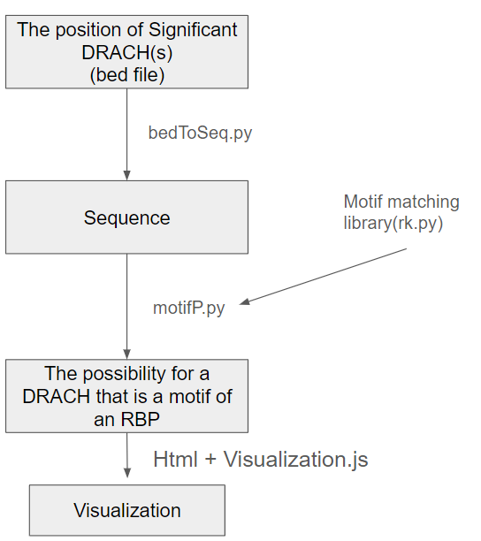

# DRACH_RBP_predict
A pipeline to predict the RBP for DRACH

# Dependencies

# Work flow

# Usage

# Todo
- [x] bedToSeq.py 
- [x] test bedToSeq.py
- [x] Motif.py
- [ ] test Motif.py
- [x] Modify rk.py
- [ ] Visualization.js + html
- [ ] Interactive test
- [ ] integrating test